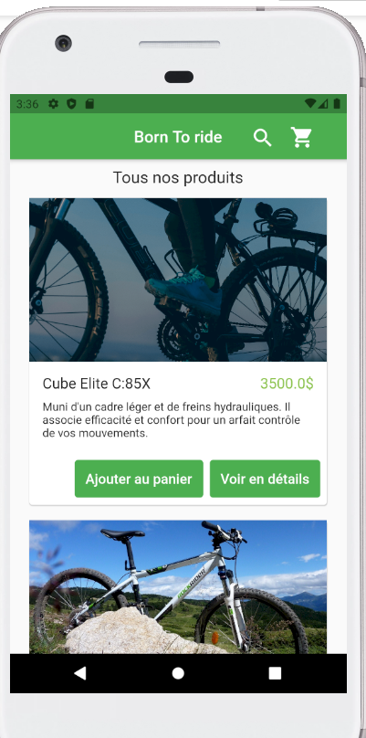
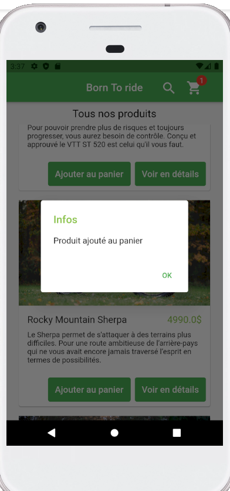
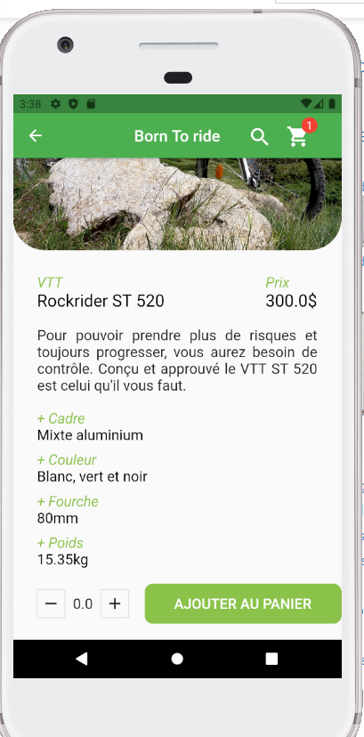
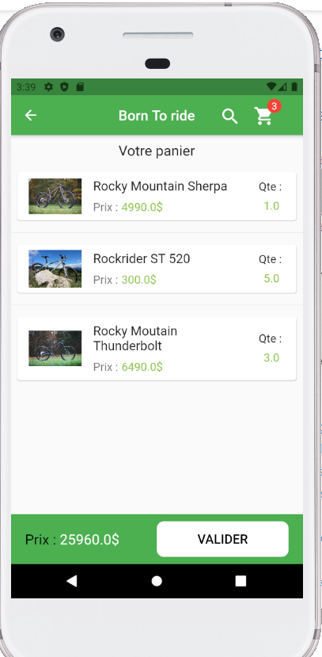
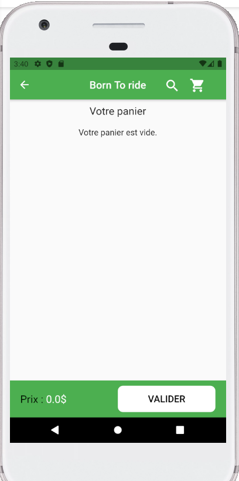
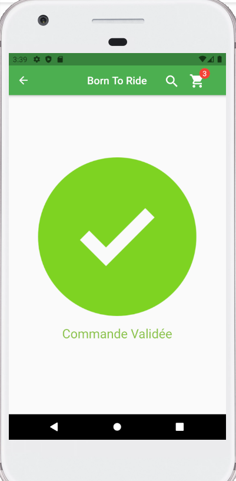

# Demo Application Mobile Flutter

Application mobile de vente en ligne.  
Thème utilisé choisit au pif.  
Les images utilisées sont libres de doits.

---------
## Technologies utilisées :

''''Dart  
''''Chrome  
''''VsCode
''''Sdk phone Pixel 5"

---------
## Fonctionnalités implémentées :

* Tous les produits sont affichés dans une vue sous forme de liste de cartes.
* L'ajout d'un produit est possible dans la liste produit et dans la vue détaillée du produit. Si un produit est déjà dans le panier, la quantité augmentera.
* Système de notifications au dessus de l'icône panier dépendant du nombre de produits dans le panier.

---------
## Fonctionnalités à implémenter :

* Intégration d'une base de données
* Outil recherche
* Menu
<del>* Captures d'écran de l'appli<del>
* Changer l'attribut ``String procuct.color`` par le widget `Color`

## Screens

Liste des produits :  
  

Liste des produits + notif d'ajout au panier :  
  

Vue détail des produits :  
  

Vue panier :  
  

Panier vide :  
  

Validation :  

